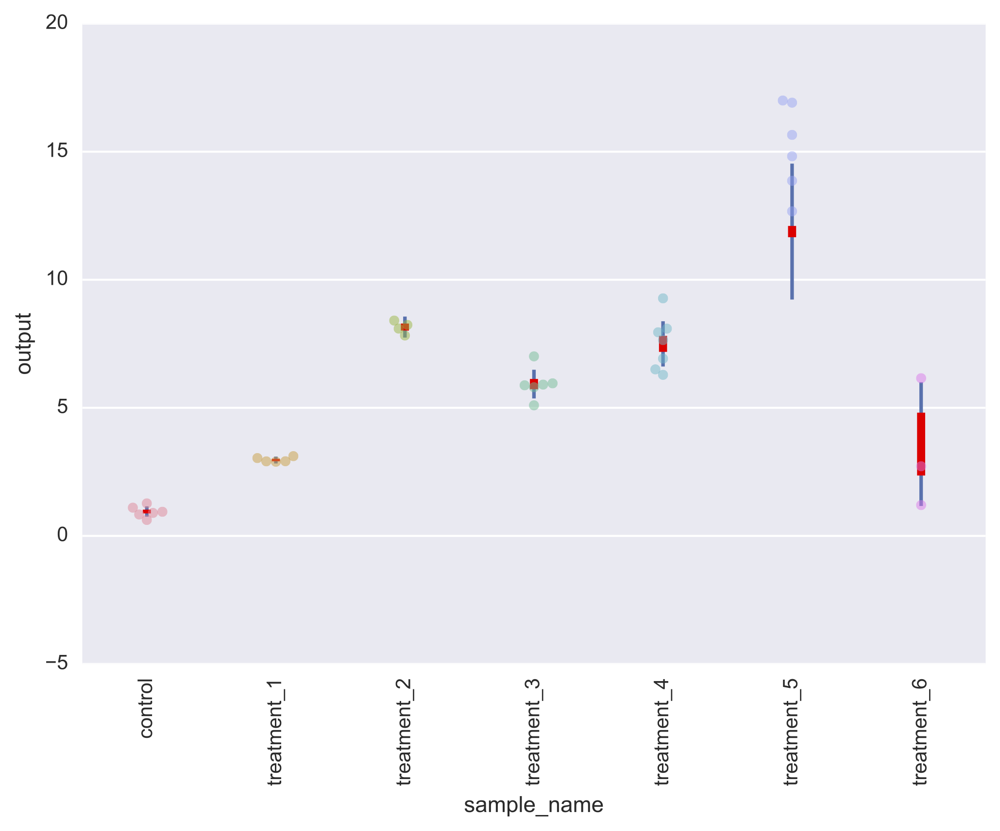
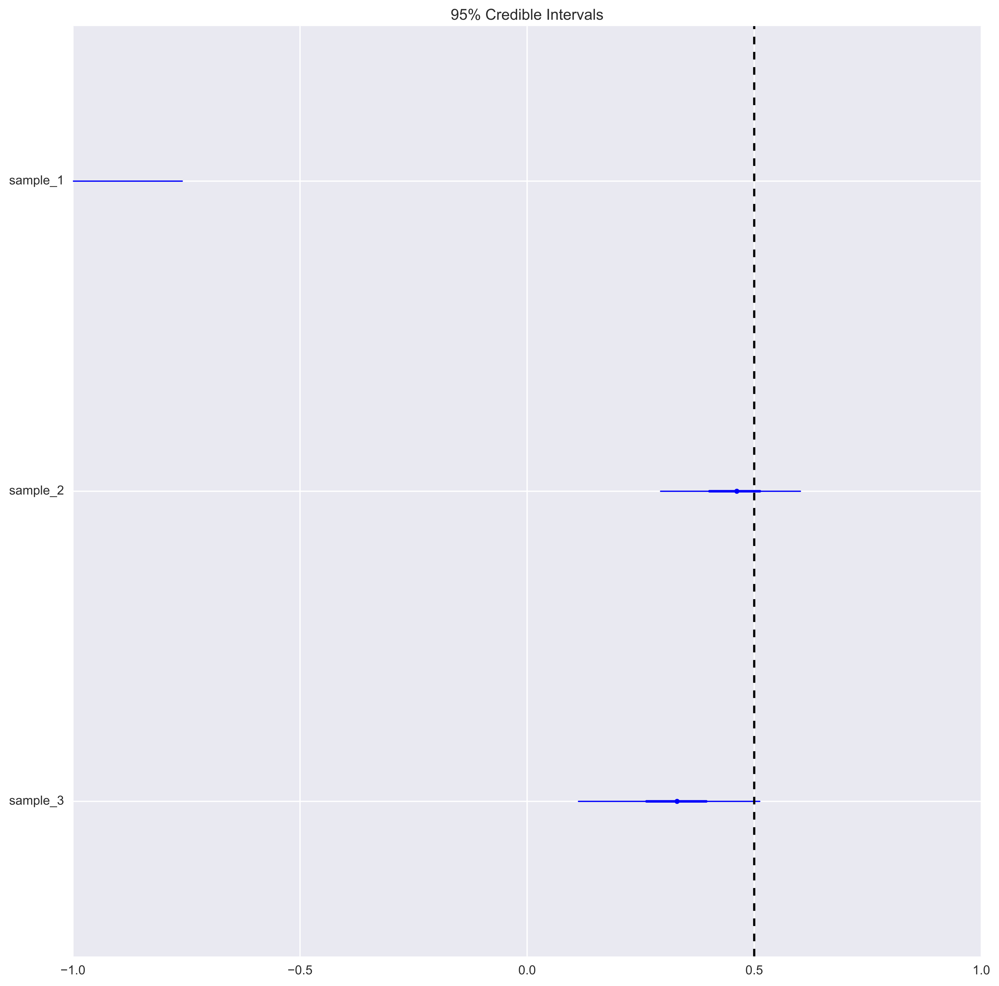
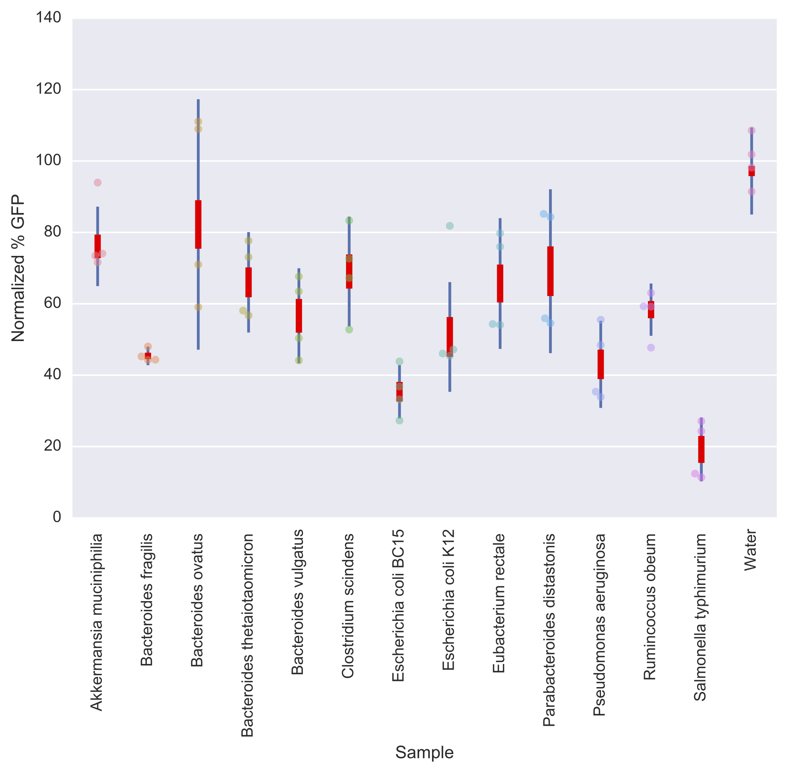

# bayesian-measurement-paper
My academic 'rant' on why n=3 is not sufficient. The manuscript source markdown file can be found at [`paper.md`](./paper.md) and [`supplementary.md`](./supplementary.md).

# htbayes

`htbayes` is a command-line program for Bayesian analysis of mutliple treatment groups relative to a control group. This experimental structure is common across multiple domains of scientific measurement. `htbayes` implements John Kruschke's two-sample (treatment vs. control) comparison model in PyMC3, but with a little bit of software engineering, extends it multiple treatment groups with a model spec that is concise.

## usage

Here's how you can use `htbayes`. First, we assume that you have a table of data (available at the [`examples/data.csv`](./examples/data.csv)):

| sample_names | output_col |
|--------------|------------|
| treatment_1  | 2.91111427 |
| treatment_1  | 3.11300205 |
| treatment_1  | 2.91440408 |
| treatment_1  | 2.89595603 |
| treatment_1  | 3.03825348 |
| treatment_2  | 8.09306305 |
| treatment_2  | 8.23790159 |
| treatment_2  | 8.40725147 |
| treatment_2  | 7.82483541 |
| treatment_3  | 5.0982492  |
| treatment_3  | 5.90737844 |
| treatment_3  | 5.87921722 |
| treatment_3  | 5.95579214 |
| treatment_3  | 5.80375375 |
| treatment_3  | 7.00952225 |
| ...          | ...        |
| control      | 0.83613758 |
| control      | 1.1019812  |
| control      | 1.26966994 |
| control      | 0.94195778 |
| control      | 0.6228118  |
| control      | 0.8965097  |

`htbayes` assumes that the measurements are structured as a flat file, in which each row is one measurement, and replicate measurements of the same treatment are different rows.

`htbayes` is executed from the command-line as such:

```
$ python htbayes.py --filename [FILENAME] --output_col [OUTPUT_COL] --sample_col [SAMPLE_COL] --baseline_name [BASELINE_NAME] --n_steps [N_STEPS]
```

If you can't remember what the arguments are, at the command line prompt, type:

```
$ python htbayes.py --help
Usage: htbayes.py [OPTIONS]

Options:
  --filename TEXT       File name of the data in CSV format.
  --output_col TEXT     Name of column that contains data.
  --sample_col TEXT     Name of column that contains sample names.
  --baseline_name TEXT  Name of positive control in sample names column.
  --n_steps INTEGER     Number of iterations for ADVI.
  --help                Show this message and exit.```

The sample data follows the default data specification that `htbayes` accepts, which is namely:

- `--filename`: `data.csv`
- `--output_col`: `output`
- `--sample_col`: `sample_name`
- `--baseline_name`: `control`

If you change the filename, the output column name, the sample column name, or your control name from the defaults above, you'll have to specify them at the command-line. One example, where the `output_col` and `sample_col` parameters are changed, is as such:

```
$ python htbayes.py --output_col "Measurement" --sample_col "Genotype"
```

## example with sample data

You can run the example data directly from the repository, without needing to pass any additional parameters:

```
$ python htbayes.py
```

### plots

`htbayes` will return a series of plots.

The first is a **summary plot** that combines `seaborn.swarmplot` with `pymc3.forestplot` to produce a combined plot that displays both:



The interpretation of the plot is as such. The `swarmplot` shows the distribution of all of the data points for each treatment (`sample`). The bars show the posterior distribution data; blue-coloured bars show the 95% HPD, and the red-coloured bars (slightly thicker) show the inter-quartile range.

The second plot produced is a **"Z-factor" forest plot**, which is a measure of the distributional separation between the treatment and controls.



The interpretation of the Z-factors can be found in the [original reference](https://www.ncbi.nlm.nih.gov/pubmed/10838414).

## example with experimental data

The data here are from a colleague Christopher Bandoro (MIT Microbiology), who has kindly agreed for the data to be used as a test case. I intentionally leave out any interpretation of the data in the context of his work, as it is intended for publication elsewhere. The focus here is on the statistical modelling. Each of his samples here have had 4 replicate measurements taken over two experimental runs. The result is the following plot:


