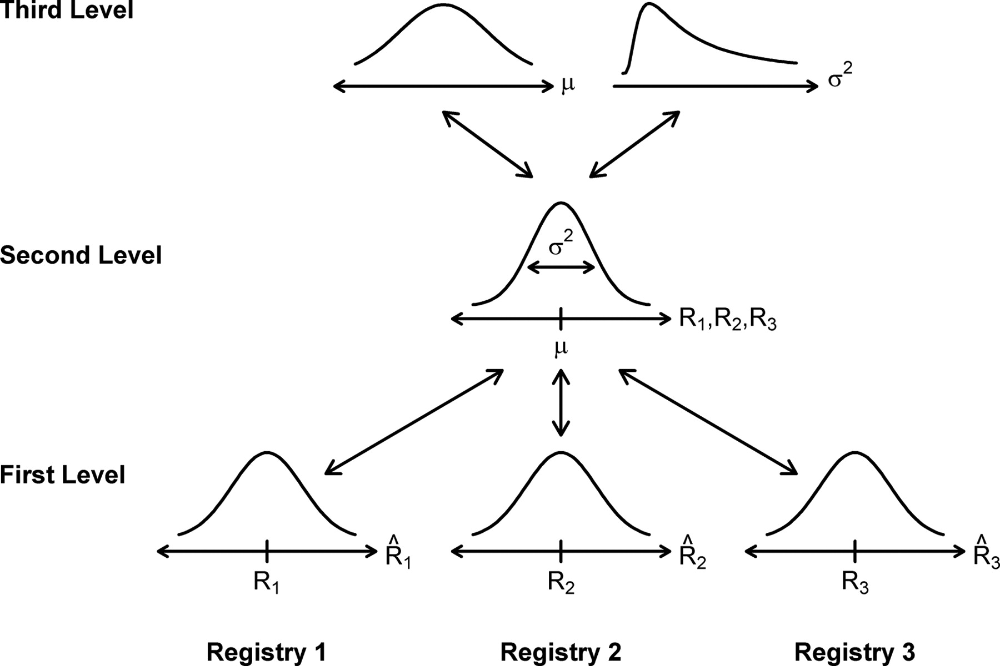

# Abstract

key points:

- describe a simple and accessible framework for molecular HT analysis that is sorely missing from the literature. covers the following:
    - Bayesian estimation of fold changes relative to some control, with decision rule for a hit.
- approach: rather than analytical, use probabilistic programming, with approx. inference tools used.
- accompanying software that analyzes fold change data in an accessible fashion (?)

# Introduction

High throughput (HT) screening experiments are necessary for systematically interrogating biology. Statistical tools have been developed for HT data analysis, for example, the Z- and Z'-factors [@Zhang:1999fr; @Edwards:2015ig; @Lee:2010if; @Sui:2007dc] for assay evaluation and identifying true hits, per-plate Z-score normalization [@Malo:2006kg], ANOVA [@Su:2010gb] and the "three standard deviation" (3-SD) rule-of-thumb [@Zhang:1999fr]. These statistical tools would be useful, if not for the widespread use of small sample sizes [@Edwards:2015ig; @Wang:2015ba] risking the measurement of false positives and negatives.

Crucially missing from the HT literature are general and extensible Bayesian analysis methods for HT assays. Bayesian methods offer several advantages over the traditional Null Hypothesis Significance Testing (NHST) [@Kruschke:2013jy], including the ability to incorporate prior knowledge where appropriate, model and quantify uncertainty in estimated values. As Bayesian analysis returns a full probabilistic description of the data, multiple hypothesis testing is not an issue as any further comparisons are merely extended summaries of the probabilistic output.

To address the problem of a lack of Bayesian analysis methods, we use a probabilistic programming approach to develop a simple Bayesian hierarchical model of a 'generic' HT assay. In this generic assay, the activity of a sample is being determined relative to a blank well and a positive control. Using this simple Bayesian hierarchical model, we are able to simultaneously provide Bayesian posterior distributions of Z-factors for each sample the assay and for the assay in general, dynamic range of the assay, and fold change activity for each sample. We then address is where and when the common experimental practice of duplicate (`n=2`) or triplicate (`n=3`) are sufficient for detecting true hits.

<!-- potential references:

1. Enhancing reproducibility in cancer drug screening: how do we move forward? http://www.ncbi.nlm.nih.gov/pubmed/25015668
1. Linear models and empirical bayes methods for assessing differential expression in microarray experiments. http://www.ncbi.nlm.nih.gov/pubmed/16646809
1. Empirical Bayesian analysis of paired high-throughput sequencing data with a beta-binomial distribution. http://www.ncbi.nlm.nih.gov/pmc/articles/PMC3658937/
1. Bayesian Analysis of High-Throughput Quantitative Measurement of Protein-DNA Interactions http://journals.plos.org/plosone/article?id=10.1371%2Fjournal.pone.0026105 -->

# Analysis Framework and Simulated Data

<!-- key points:
- experimental setup: a generic "fold change" experiment. To make things concrete, do systematic measurement of protein phenotypes (akin to Stanford HIV DB data.)
    - batch effects are controlled for by having internal controls and standards
    - randomization in position is ideal, but may be difficult to achieve in practice.
    - single replicates per plate, use replicate plate measurements.
    - need figure
- simple Bayesian hierarchical model (BGM) of final readout
- what needs to be modelled, and what can be ignored? By setting things up such that plates are internally consistent, only need to do single replicates per plate, but do replicate plates on different experimental runs.
- error modelled as 95% HPD in posterior distribution -->

If carefully considered, the problem of high throughput measurement at it essence is the measurement and estimation of a sample's real-valued property, relative to a standardized control. These are measured relative to a "blank" that should reliably exhibit an instrument signal below its lower limit of detection.

As a concrete example, consider the problem of systematically characterizing a protein mutant family. A standard design for this experiment might involve the following:

1. A blank well to define lower instrument detection limit
1. A negative control which forms a biological baseline measurement (e.g. reporter plasmid transfected without protein of interest), which may or may not return the same value as the blank.
1. A positive control that reliably returns a positive signal.
1. The suite of samples that require testing.

In this setup, the blanks and controls are measured on every single plate, providing a "ladder" against which the data can be compared; with many fold more replicate measurements than individual samples, they will also have a more accurate estimate of the true mean and variance. Additionally, rather than reporting "Relative Luminescence/Absorbance Units", as is common practice in the literature, we consider the following normalization procedure in order to achieve comparability between experiments.

Firstly, the limit of detection is not assigned a zero-value, but assigned the relative value of "1" instead. Data that can be used to model uncertainty of the blank is done by taking ensuring that there are two blank wells on the plate. One of the wells is considered "true blank", and the other is treated as a measurement for quantification of the technical uncertainty in the blank well.

Secondly, the samples and controls have their raw readings normalized to the "true blank" `tb`. This allows every reading to be normalized to (i.e. divided by) the lower limit of detection, with the smallest value being 1, and is given by Equation @eq:fold_blank, where `i` encompasses all samples, the controls, and the replicate blank. This normalized value is used for modelling the error in the fold changes. On each plate, each well gets at least a single replicate measurement; if there is space for duplicates, each replicate is considered an independent measurement of the activity relative to blank, rather than a value to be averaged.

$$ \mu_i = \frac{r_i}{r_{tb}} $$ {#eq:fold_blank}

Thirdly, with replicate plate measurements, there will be variation in the fold change relative to blank. Each computed fold change on the replicate plate is likewise considered an independent fold change measurement.

With this data on hand, we now consider the Bayesian hierarchical model. While it is possible to use informative prior information on the data, we consider here the "worst case" scenario in which little to nothing is confidently known about the distribution of fold changes and errors for individual samples, except that they may be drawn from a common distribution that is likewise not well defined. Hence, priors are specified as uninformatively as possible.

We assume that the fold changes relative to blank are drawn from an exponential distribution (+@eq:fold), where the lambda parameter is assumed to be some unknown small value drawn from the beta distribution skewed towards a small number (+@eq:lambda), essentially behaving as a flat positive prior.

$$ \mu_{i} \sim Exp(\lambda) $$ {#eq:fold}

$$ \lambda \sim Beta(\alpha=10, \beta=1) $$ {#eq:lambda}

This places a positive real-valued prior on the master fold change distribution.

The errors `sigma` in fold change measurements are assumed to be heteroskedastic, and drawn from a `gamma` distribution, likewise also placing a positive and real-valued but essentially flat prior on the error.

$$ \sigma_{i} \sim Gamma(\alpha=1, \beta=1) $$ {#eq:sigma}

The data likelihood `L` is modelled as a Normal distribution:

$$ L \sim Normal(\mu=\mu_{i}, \sigma=\sigma_{i}) $$ {#eq:likelihood}

This model is expressed as a probabilistic graphical model (PGM) in Figure @fig:pgm.

{#fig:pgm}

Having modelled these variables, we can now deterministically compute fold changes and their full distributional uncertainty, given the data. If the positive control were of interest as a "reference" standard, then the fold change `f` of each sample `s` relative to the positive control `pc` could be computed as:

$$ f_{s} = \frac{\mu_{s}}{\mu_{pc}} $$

Likewise, the Z- and Z'-factors and their distributional uncertainty may be computed using the formula provided by [@Zhang:1999fr].

$$ Z = 1 - \frac{3\sigma_{s} + 3\sigma_{b}}{|\mu_{s} - \mu_{b}|} $$

# Results

## Modelled Error in estimate as function of number of replicates

key points:

- result: variance in error (modelled mean - real mean) decreases with increasing replicate measurements.
- n=2 or n=3 might not be the best thing to do, especially if uninformative priors are used.
- in general, fold change estimate precision increases with number of samples; also, variation in error decreases.

## Dealing with outliers

## Small-scale real-world measurement data.

key points:

- put analysis of polymerase assay data here; can even just be Vivian's replication data and that would be sufficient.

# Discussion

## Outliers

## "Precision is the goal"

key points:

- `n=3` + NHST has led to the proliferation of false positive results in the literature.
- `n=some_value` + bayesian can let us identify measurements that have a high degree of uncertainty/variation.
- decision rule is possible: check that 95% HPDs are non-overlapping. alternatively, have a pre-defined ROPE (Kruschke). emphasize: no free lunch.
- deciding whether something is significant should still be on the basis of "biological" significance, not "statistical" significance.
