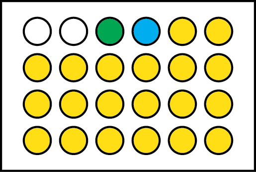

# Supplementary Materials

# Analysis Framework

## Experimental Setup

If carefully considered, the problem of high throughput measurement at it essence is the measurement and estimation of a sample's real-valued property, relative to a standardized control. These are measured relative to a "blank" that should reliably exhibit an instrument signal at its lower limit of detection.

As a concrete example, consider the problem of systematically characterizing a protein mutant family. A standard design for this experiment might involve the following (Figure @fig:assay-scheme):

1. A blank well to define lower instrument limit of detection.
1. A negative control which forms a biological baseline measurement (e.g. reporter plasmid transfected without protein of interest), which may or may not return the same value as the blank.
1. A positive control that reliably returns a positive signal.
1. The suite of samples that require testing.

{#fig:assay-scheme}

In this setup, the blanks and controls are measured on every single plate, providing a "ladder" against which the data can be compared; with many fold more replicate measurements than individual samples, an experimenter will have a more accurate estimate of their true means and variances. As the commonplace "relative luminescence units" do not allow for easy inter-comparison between experiments, we consider the following normalization procedure in order to achieve this.

Firstly, the blank is subtracted from every well, to standardize the samples.

Secondly, the samples `{i = 1, 2, 3, ... n, pc, nc, b}` and controls have their raw readings `r` normalized to the "true blank" `tb`. This allows every reading to be normalized to (i.e. divided by) the lower limit of detection, with the smallest value being 1. The fold relative to blank `µ` is given by Equation @eq:fold_blank, where `i` encompasses all samples, the controls, and the replicate blank. This normalized value is used for modelling the error in the fold changes. On each plate, each well gets at least a single replicate measurement; if there is space for duplicates, each replicate is considered an independent measurement of the activity relative to blank, rather than a value to be averaged.

$$ \mu_i = \frac{r_i}{r_{tb}} $$ {#eq:fold_blank}

Thirdly, with replicate plate measurements, there will be variation in the fold change relative to blank. Each computed fold change on the replicate plate is likewise considered an independent fold change measurement.

Using this experimental setup ensures that batch effects are accounted for in the measurement. Provided that there is little variation in the measurement of the blanks, every other sample's readings can be reliably normalized with uncertainty proportional to its true variation. The readings allow one to model the signal strength relative to noise.

## Bayesian Hierarchical Model

With this data on hand, we now consider the Bayesian hierarchical model. This model is an extension of the BEST model, in which more than one "treatment" is considered.

We assume that the fold changes relative to blank are drawn from a uniform distribution from 10^-10^ to value `u` (+@eq:fold), essentially behaving as a flat positive-valued prior. The lower limit is set to an infinitesimally small value, allowing for uncertainty in the blank measurement. In order to use the data to estimate the upper limit of detection, we place a positive real-valued Exponential prior on it +@eq:upper.

$$ u \sim Exponential(\lambda=0.05) $$ {#eq:upper}

$$ \mu_{i} \sim Uniform(lower=l, upper=u) $$ {#eq:fold}

This places a positive real-valued prior on the master fold change distribution.

The errors `sigma` in fold change measurements are assumed to be drawn from a HalfCauchy distribution as recommended in [@Gelman:2006di], expressing our prior belief that the variance should be positively valued and low, but could also take high values.

$$ \sigma_{i} \sim HalfCauchy(\tau=5) $$ {#eq:sigma}

The data likelihood `L` is modelled as a Students T distribution, to account for potential outliers, with `nu` degrees of freedom as a prior.

$$ \nu \sim Exponential(\lambda=\frac{1}{30}) $$ {#eq:nu}

$$ L \sim StudentsT(\nu=\nu, \mu=\mu_{i}, \sigma=\sigma_{i}) $$ {#eq:likelihood}

Having modelled these variables, we can now deterministically compute fold changes and their full distributional uncertainty, given the data. Assuming the positive control were of interest as a "reference" standard, then the fold change `f` of each sample `s` relative to the positive control `pc` could be computed as:

$$ f_{s} = \frac{\mu_{s}}{\mu_{pc}} $$ {#eq:fold_change}

Z- and Z'-factors are used for assay evaluation and sample hit identification, relative to a baseline. Statistically, it is a measure of separation between two distributions, with possible values ranging from negative infinity to 1, with values closer to 1 indicating better separation, and hence better ability to resolve the two samples. With the posterior distribution of estimated fold changes and their variance, the Z- and Z'-factors and their distributional uncertainty may be computed using the formula below [@Zhang:1999fr]:

$$ Z = 1 - \frac{3\sigma_{s} + 3\sigma_{b}}{|\mu_{s} - \mu_{b}|} $$ {#eq:z_factor}

## HT assays

To provide a concrete example, consider a high throughput assay measuring the drug resistance value of a family of protein variants relative to a standardized control. In a 96-well format experiment, a researcher would at the minimum have to include a "blank" well and one well for the reference control. Traditionally, the plate is set up such that each mutant (including the blank and reference) is measured in triplicate on one plate; this captures biological variation within a single plate. In a puzzling move, the data are normalized by subtracting the mean of the blanks' values from every well (by definition resulting in at least one negatively-valued blanks well if there is variation in the measured blanks). The mean of each triplicate sample is then divided by the mean of the references, thereby making the assumption that the reference sample is properly measured. This forms the fold change calculation for one plate, apparently controlling for biological variation.

This procedure is replicated two more times, and the mean and variance of the three fold changes calculated are taken to be the data to be published. This two-step calculation procedure is supposed to account for biological and technical variation hierarchically, but much data are lost in averaging the computed means from triplicate measurements in one plate. In an even more puzzling move, some researchers choose to pool all 9 measurements together after 'eyeballing' the data to determine that the values are roughly the same, discarding altogether the need to reference for technical variation resulting from batch effects.

----

Statistical tools have been developed for HT data analysis, for example, the Z- and Z'-factors [@Zhang:1999fr; @Edwards:2015ig; @Lee:2010if; @Sui:2007dc] for assay evaluation and identifying true hits, per-plate Z-score normalization [@Malo:2006kg], ANOVA [@Su:2010gb] and the "three standard deviations" (3-SD) rule-of-thumb [@Zhang:1999fr].

----

We then considered how the number of replicate measurements per sample affected our ability to accurately measure the true fold change value. We simulated 5000 unique genotypes, each with a different `mu` and `sigma` drawn from their respective distributions, with a range of 2 to 10 replicate measurements. As shown in Figure @fig:errors, the error in the estimated fold changes is centred around zero regardless of the number of replicate measurements, but the variation in this error decreases with increasing replicate measurements.

{#fig:errors}

---

The core of the framework lies in obtaining measurements that reflect the "fold difference relative to blank". This is predicated on having "blank" values that are necessarily positive. In the event that negative values are obtained, the data can be linearly pre-shifted such that the most negative blank now takes the value of "1". The cloned blank can then be used in the estimation of the uncertainty around the blank.

The framework is extensible to scenarios that we did not consider here. For example, some research groups may opt to do technical replicates per experimental run, take the average of the technical replicates for a sample, and repeat the procedure over replicate experimental runs.

Using the analysis framework with fairly uninformative priors (with the exception of measurement variation, `sigma`), we use simulation studies to show that the commonplace practice of duplicate or triplicate experimental runs with single replicates per run may result in low estimation accuracy. By simply increasing the number of experimental runs to `n=4` or `n=5`, large gains in measurement accuracy may be realized. We recommend that high throughput experimentation consider larger replicate experimental runs.

One advantage in taking a Bayesian view of the data is that multiple hypothesis corrections do not become an issue, and as such no "conservative" or "liberal" corrections (e.g. Bonferroni) need to be applied that may further increase the risk of false negatives or positives. The posterior densities fully summarize our best belief about the parameters (e.g. fold changes & Z-factors), and so any further comparisons are summaries of the summary. That is not to say that false positives and negatives can be avoided; as measurements are considered to be "random samples" from the true distribution, it is still probable to have biased measurements, and hence posterior densities, purely by random chance. Other advantages of the Bayesian approach have been espoused before [@Lin:1999cd; @Kruschke:2013jy], and we do not treat them further here.

---

## Software

- to aid in spreading of this idea, we have released the software under an MIT license
- also provided a GUI interface for specifying priors and conducting analysis, with sensible uninformative defaults.

---

key points:

- `n=3` + NHST has led to the proliferation of false positive results in the literature.
- `n=some_value` + bayesian can let us identify measurements that have a high degree of uncertainty/variation.
- decision rule is possible: check that 95% HPDs are non-overlapping. alternatively, have a pre-defined ROPE (Kruschke). emphasize: no free lunch.
- deciding whether something is significant should still be on the basis of "biological" significance, not "statistical" significance.
